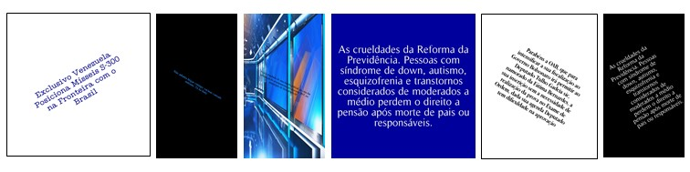

# ImageFactCk.br-dataset-SBBD-DSW-2023

Neste repoítório estão presentes os scripts de manipulação de regex bem como os de geração de datasets conforme descrito no artigo ImageFactCk.BR: Repositório de 
Imagens para a Detecção de Desinformação Disseminada em Plataformas Digitais publicado no SBBD 2023 – Simpósio Brasileiro de Bancos de Dados.
